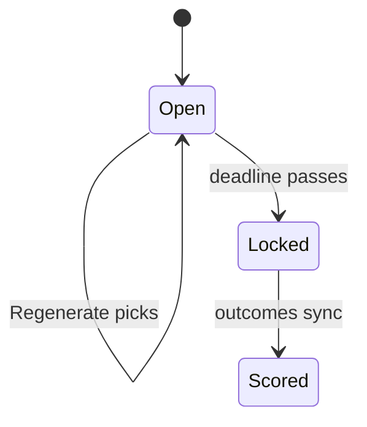

# Legion Pool

A web app that generates each week's Legion pool picks, so a missed check-in (say,
while traveling) still produces the tool's own picks. Ranking reuses the math from the
legacy `football_enhanced.py`: de-vigged moneyline probability, highest confidence
gets the most points.

| Piece | Role |
|---|---|
| `picks_core.py` | Week detection, game selection, ranking, deadline, lock decision, scoring |
| `store.py` + `db_schema/` | SQLite persistence and migrations |
| `panels/` | Picks and Settings tabs — render only; decisions live in `picks_core` |

## A week's lifecycle

- **Open:** "Regenerate picks" overwrites the `'current'` snapshot. A per-game checkbox
  lets you include or exclude games, since the bylaws only say "almost always."
- **Lock:** checked on every page load; there's no scheduler. `resolve_week_lock()`
  reuses the last generated snapshot (values and timestamps). It computes fresh picks
  only if none exist. If odds are missing and there's nothing to reuse, the week stays
  open with a warning. A fresh lock computed after a kickoff stores a `lock_warning`.
- **Locked:** read-only. The view reorders by phase (`week_phase()`):
  - no game final → picks and the actual-submission form;
  - games in progress → live score and game-by-game first, then picks;
  - all final → reported-score entry first, then the result, then picks.

## Game selection (bylaws rule 14)

Regular-season games only, by the week's rule:

| Rule | Selected games | Deadline | Unknown kickoff time |
|---|---|---|---|
| `standard` | Kickoff from Sunday 13:00 ET through Tuesday | Earliest selected kickoff | Excluded |
| `all_games` | Every game (at/after the deadline once one is set) | Commissioner-set cutoff, before every kickoff | Included |

- The standard window keeps early games (Thursday, international) off the sheet so their
  results can't leak before the deadline. A real datetime window also catches a rare
  Tuesday makeup game.
- `all_games` covers the final weeks: `store.KNOWN_LATE_SEASON_WEEKS`, 16–18 in 2026,
  17–18 in 2025. **Re-check against each season's bylaws.** These weeks default to
  `all_games` even before anyone visits Settings. The deadline falls back to the earliest
  kickoff until it's configured.
- `select_games()`/`week_deadline()` take the rule as a parameter; the panel looks it up
  via `store.get_week_rule()`.

## First vs. current snapshot

Each game has up to two snapshots: `'current'` (latest, frozen at lock) and `'first'`
(captured once). `'first'` is only claimed by a manual regenerate inside the first-look
window (3 days before the earliest kickoff to 1 day after). That way, browsing ahead
doesn't count as a real first review. Auto-locks never claim it. A week locked without
any manual generation has only `'current'`, and the Snapshot toggle hides.

## Actual picks and scoring

- **Actual picks** default to the algorithm's picks, so "I agreed" is one click. The form
  accepts what the bylaws resolve rather than reject: duplicate points (rule 7),
  blank points (15), an unmarked winner (16), and a late card. `check_actual_picks()`
  explains each with its rule.
- **`score_picks()`** scores algorithm and actual picks the same way. Ties score zero
  (rule 6); shared point values count once (rule 7). Undecided games show as "6/9
  decided."
- **Reported score** is entered by hand from the commissioner's sheet. The late-card
  penalty (rule 2) depends on other entrants' scores, so for a late card the reported
  score is authoritative. Otherwise `check_reported_score()` flags any mismatch.

## Data model

| Table | Holds |
|---|---|
| `seasons` | Active season; Sunday-afternoon cutoff |
| `season_week_rules` | Rows only for non-standard weeks: rule + deadline override |
| `teams` | Abbreviation → pool-sheet display name (seeded, editable in Settings) |
| `games` | Schedule facts and final scores, for games the app evaluated |
| `algorithm_versions` | Each `ALGORITHM_VERSION` that produced picks |
| `weekly_games` | Odds + `included` flag per game per snapshot |
| `weekly_picks` | Points, winner, confidence, algorithm version per snapshot |
| `week_status` | Lock state, timestamps, lock warning, reported score |
| `actual_picks` | What was really submitted; nullable fields on purpose |

- **Reference vs. event data:** `games`/`teams` are stable facts; `weekly_*` are
  per-generation snapshots keyed `(game_id, snapshot_type)`.
- **`games` scores** are backfilled by `sync_game_outcomes()` on each page load. It only
  updates existing rows, never inserts.
- **Bump `ALGORITHM_VERSION`** and describe it whenever the ranking math changes.
- **Migrations:** `store.connect()` applies new `db_schema/migrations/NNNN_*.sql` files
  in order. Every schema change gets a new file. (The package is named `db_schema`
  so it can't collide with the `schema` PyPI package.)

## Settings tab

Active season, late-season deadlines, Sunday cutoff, and team display names. All of it
is data, not code, so a yearly bylaws change needs no redeploy.

## Static assumptions

| Assumption | Revisit when |
|---|---|
| `KNOWN_LATE_SEASON_WEEKS = (16, 17, 18)` | Every season's bylaws — it has already changed once |
| `game_id` stays stable across a season | Unverified over a full season; watch for it |
| Sunday cutoff is 13:00 ET | The pool includes an earlier Sunday game (Settings value) |
| March is the season-year boundary (`default_season_year`) | Someone uses the app in February |
