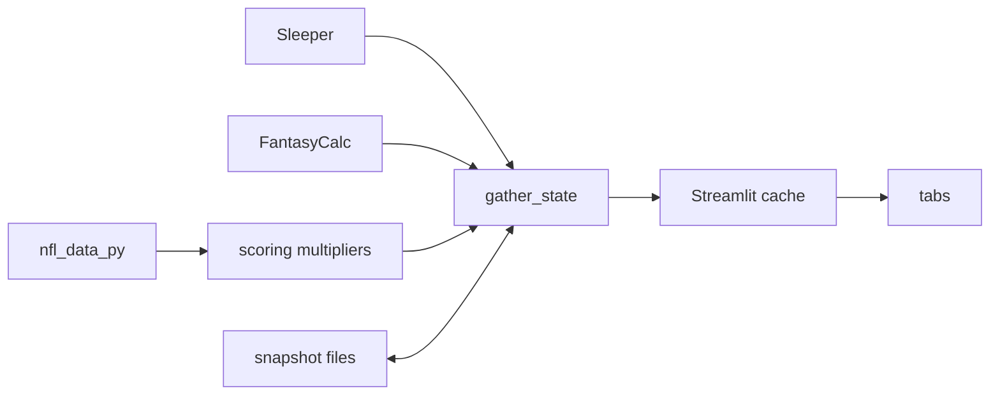

# Dynasty Data Model

What's cached where, how fresh it is, and where new data should live.

## Kinds of data

| Kind | Examples | Storage | Freshness |
|---|---|---|---|
| Live imports | league, rosters, draft, picks | none | every refresh |
| Slow imports | Sleeper players (~14MB), FantasyCalc values | `.cache/` JSON | 12h TTL; Advanced refresh forces |
| Expensive derived | real-scoring multipliers (1–2 min `nfl_data_py` pull) | `.cache/` JSON | never expires; only the explicit "Recompute scoring multipliers" option |
| Cheap derived | big board, marginal value, power read, draft plan | none | recomputed every refresh (~4s total) |
| Accumulated state | draft drop attribution, player team/status history | `.cache/` JSON snapshots | merged forward, never expires |
| User-entered | trade block | `dynasty_data/trade_block.db` (SQLite) | live |
| On-demand results | Suggested Trades scan | `st.session_state` | tied to one state version |

The whole `gather_state()` output is also held in Streamlit's process cache (1h TTL),
so the first place to look for a staleness bug is that cache, not the derived layers.
`.cache/` and `dynasty_data/` are separate Docker volumes.

## Snapshot files

`draft_snapshots.py` (one file per draft) and `pickup_snapshots.py` (one per
league-season) stay separate because their keys and lifecycles differ.

- **Versioned:** each module declares `SCHEMA_VERSION` and `_MIGRATIONS`. The shared
  loader in `snapshot_io.py` migrates on read and writes the stamped file back. A missing
  migration, or a file newer than the code, raises instead of guessing.
- **Orphan cleanup** (draft snapshots): a file untouched for `ORPHAN_AGE_DAYS` is
  renamed `.orphaned`. It's deleted only after a further 24h, which leaves a real window
  to rescue a wrongly marked file.

## On-demand results carry the state version

`load_state()` stamps `state["version"]` on every real fetch. An on-demand result is
stored as `{"state_version": ..., "results": ...}` and dropped on read when the version
doesn't match, so a refresh can't leave stale offers on screen. Follow
`trade_tab.py`'s leaguewide scan for any new on-demand feature.

## Why mostly JSON, not a database

One user, one process, no concurrent writers, key lookups only. SQLite is used only
where the user edits data in the app (the trade block). Revisit if the app needs
cross-season queries, concurrent writers, or joins across the snapshot files.
