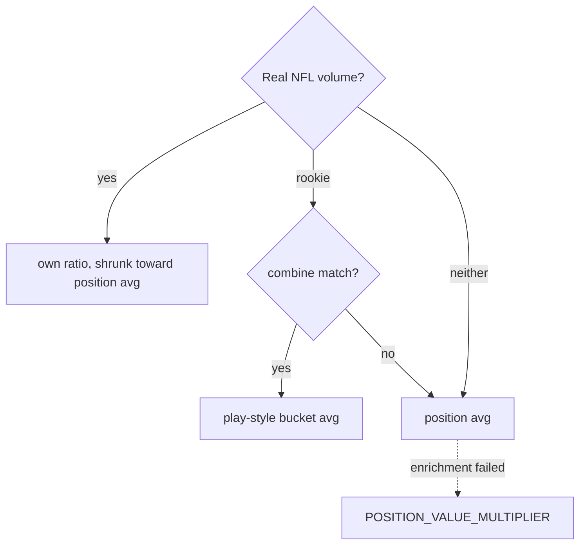

# Dynasty Methodology

How `dynasty_core/` values players and makes recommendations for the "Dynasty
Degenerates" Sleeper league (`1324888291937386496`): superflex, rebuild strategy.

## Data sources

| Source | Provides |
|---|---|
| Sleeper (`sleeper_api.py`) | League settings and scoring, rosters, draft, picks, transactions, weekly projections, players (~14MB) |
| FantasyCalc (`fantasycalc_api.py`) | Dynasty market value — the only absolute value source |
| `nfl_data_py` | Byes, depth charts (handcuffs), weekly + play-by-play stats, combine data |

## Valuation: market value × scoring correction

FantasyCalc only knows superflex, league size, and PPR. This league also scores 6-pt
passing TDs, a custom passing-yard rate, −3 INTs (−6 more for a pick-six), a TE
reception premium, and first-down/long-play bonuses. `player_scoring.py` corrects for
these: `adj_value = value × multiplier`. The raw `value` is always kept beside it.

- **Ratio** = the player's points under league scoring ÷ points under FantasyCalc's assumed
  `BASELINE_SCORING`, over 3 seasons. Play-by-play data covers long-play bonuses and
  pick-sixes.
- **Shrinkage:** weight `volume / (volume + k)`, with
  `k = QUALIFYING_VOLUME × LOOKBACK_SEASONS`. A full-time starter in every season gets
  half weight on their own ratio.
- **Sanity bounds:** a ratio outside `[0.5, 2.0]` falls back a step (real ratios land
  in 1.08–1.61).
- **It never lowers RB/WR/TE value**, since every extra rule for them adds points. QB has
  penalties but hasn't dropped below 1.23. Every position is inflated, by different
  amounts (QB ~1.40, TE ~1.32, RB ~1.17, WR ~1.15), so only *relative* standing shifts.
- **Linearity check:** the ratio is flat across value tiers (<2% spread at every
  position, 2022–24). So a flat multiplier doesn't distort standing within a position.
  Re-run with `scripts/check_scoring_correction_assumptions.py`.
- Cached with no TTL; recomputed only by the explicit Advanced-refresh option.

### Rookie play-style buckets

Rookies have no NFL stats, so combine data splits each position at the historical median:

| Pos | Metric | Buckets |
|---|---|---|
| QB | 40-yd | mobile / pocket |
| RB | weight | receiving_back / early_down |
| WR | 40-yd | deep_threat / possession |
| TE | weight + 40 composite | receiving / in_line |

Coverage is partial: a rookie needs a combine invite and a Sleeper ID match. Unmatched
rookies get the position average. A continuous regression was tested and gained ≤2%,
because combine metrics barely predict the ratio. College production would be the
better next input.

## Ranking: marginal lineup value

Candidates rank by how much they raise the roster's **season-average optimal lineup**,
not by `adj_value`. A modest player at a thin position can beat a star who wouldn't start.

- **`assign_starters()`** fills dedicated slots, then FLEX, then SUPER_FLEX. Because slot
  eligibility is nested, this greedy order is provably optimal. Taxi/IR players never start.
- **`season_average_starter_value()`** runs that for all 18 weeks, skipping byes, and
  averages. It captures bye *interactions* (a pickup whose bye collides with a thin spot).
- **`rank_by_marginal_value()`** simulates adding each candidate plus the forced drop.
- **`recommend_drop()`** drops the lowest-value bench player before any starter. Taxi/IR
  players can be dropped but never start. A drop happens only at total capacity
  (active + taxi + *occupied* IR). Rookies are assumed taxi-eligible; other adds aren't.

## Roster signals

- **`need` vs. `weak`** — two different questions:
  - **`need`** (rebuilding teams): fewer than `YOUNG_CORE_NEED_THRESHOLD` young players
    at a position.
  - **`weak`**: `vor <= 0`, where `vor` = the team's top-N value minus N × the
    league-wide replacement level. N comes from `_position_starter_demand()`, which counts
    SUPER_FLEX toward QB.
  - Once a team isn't rebuilding, `need` means `weak`. `_need_from_phase()` is the only switch.
- **Power/timeline** (`team_power_timeline_scores()`): the equal-weight average of three
  league-wide z-scores:
  - roster strength (summed `vor`)
  - value-weighted age
  - record (`win_pct_shrunk`, blended toward 0.5 by games played)
  - The displayed `win_pct` is the real record.
  - `quality_score` and `timeline_score` are exposed separately.
  - `phase` buckets the score at ±0.3 and also gates `need` and drop notes.
  - Computed for all teams at once, every refresh.
- **Roster value analysis**: lowest value first. Low value + young = hold; low value +
  aging = drop candidate. The aging cutoffs are per position (RB 27, WR 29, TE 30, QB 33).
  Status icons: 🆕 rookie, 🏥 injured, 🌱 taxi, 🩹 IR.
- **Bye impact / weekly gaps**: lineup loss for each bye week, counting active players
  only. Gaps check dedicated slots only.
- **Handcuffs**: RB backups from the latest depth chart. Rookies show up late, because the
  ID crosswalk lags.

## Draft plan

Every pick the user owns.

- **Past rounds** show the real pick.
- **Upcoming rounds** simulate back-to-back picks with nobody else picking in between,
  recomputed each refresh.
- **Each completed pick's drop is recovered** by diffing rosters across refreshes
  (`draft_snapshots.py`):

  | Status | Meaning |
  |---|---|
  | `confirmed` | Real drop recovered |
  | `confirmed_none` | Roster had room |
  | `ambiguous` | Several own picks in one refresh gap (permanent) |
  | `guessed` | Not yet known — heuristic |

- **Later rounds simulate from the last confirmed roster.**
- **Up to 2 alternates per round**, each flagged if it would open a weekly gap.

## Free agents

- **`free_agent_board()`**: non-rostered players on NFL teams, ranked by marginal value
  (`> 0` only), each with its best drop.
  - Undrafted rookies are excluded while the draft is live.
  - Adds assume no taxi eligibility (the real rule is unverified), but filled taxi slots
    still count as spent capacity.
- **FAAB guidance** (`waiver_bids.py`) uses real winning bids only, not a formula.
  - It takes the nearest `COMPARABLE_NEAREST_K` by current `adj_value`, within a
    distance floor. QBs never mix with other positions.
  - Below `MIN_COMPARABLE_SAMPLE` close comparables, it shows "not enough data."
  - Each comparable's value is shown so the match can be judged.
- **Pickup alerts** (Summary) track team/depth/status changes across refreshes
  (`pickup_snapshots.py`). They use the same marginal-value and drop fields, and the same
  wording helper, as the board.

## Trades

All trade tools compose `evaluate_trade()`, never a second model.

- **`evaluate_trade()`** gives two separate reads per side:
  - **lineup delta**: season-average lineup before vs. after, including forced cuts
    (`lineup_delta_after_drops`). An incoming player is never the suggested cut.
  - **asset delta**: summed `adj_value` + pick value.
  - **Callouts** cover weekly gaps opened or closed, handcuffs for kept RBs, bench pieces
    going out, instant starters coming in, and a pick's rank within its class.
  - The other side is the same call with the arguments swapped. No 3-way trades.
- **`find_trade_offers()`** (one target): searches 1–3-asset combos from your sellable
  players and picks. The partner's asset delta must be within 15% (min 25) of zero. Need
  match only breaks ties.
- **Suggested Trades**, two stages so the scan cost stays constant:
  1. `leaguewide_trade_candidates()` — every refresh: other teams' players ranked by
     marginal value and capped at what your sellable pool could afford, top 15.
  2. `suggested_trades()` — on button press: runs `find_trade_offers()` on each and keeps
     offers with `lineup_delta_after_drops > 0`. Ranks by that value, with net weekly gaps
     closed as the tiebreaker.
- **`improve_incoming_offer()`**: tries single-move tweaks (drop, swap, add) to a real
  proposal on either side. The fairness tolerance anchors on whichever side isn't
  changing. Returns accept / counter / reject.
- **`sellable_players()`**: depth beyond starters at positions with `vor > 0`. It holds
  back FLEX-eligible depth, keeps anyone whose removal opens a weekly gap, and excludes
  rookies and starters.
- **`pick_trade_values()`**: this season's picks at exact slot value; next season's at
  FantasyCalc's flat round value. Joined on FantasyCalc's pick-name string.

## Lineup tab

- **By value:** dynasty value; not injury-aware.
- **This week:** Sleeper's undocumented weekly projections × `scoring_settings` (same
  stat keys). TE premium comes from `bonus_rec_te` when present, otherwise derived.
  Long-TD bonuses (`*_td_40p`/`50p`) aren't in projections, so those points are always
  missing.

## Performance

`gather_state()` takes ~4s. The draft plan makes ~20k `assign_starters` calls. Build the
FantasyCalc lookup once (`fc_value_by_sleeper_id()`) and thread it through. Stage 2 of
Suggested Trades takes ~5s, so it stays behind a button.

## Known limitations

- The draft plan can't predict other teams' picks.
- Weekly gaps and `_position_starter_demand()` ignore FLEX for RB/WR/TE.
- Handcuffs and the "by value" lineup ignore injuries.
- Trade search targets one asset; need-match uses the partner's current roster.
- Suggested Trades doesn't target picks (no leaguewide marginal signal for them).

## Static assumptions

League settings (`roster_positions`, scoring, taxi, team count, PPR, superflex) are read
live. These are not:

| Assumption | Where | If wrong |
|---|---|---|
| Linear draft (no snake) | `compute_pick_ownership` | Raises `ValueError` |
| Slot types are QB/RB/WR/TE/FLEX/SUPER_FLEX only | `assign_starters` | Other types silently ignored |
| `BASELINE_SCORING` matches FantasyCalc's hidden model | `player_scoring.py` | Whole correction skews; unverifiable |
| `BASELINE_SCORING["rec"] = 1.0` | `player_scoring.py` | Wrong if league leaves full PPR |
| `QUALIFYING_VOLUME` bars | `player_scoring.py` | Judgment call |
| `POSITION_VALUE_MULTIPLIER` | `player_pools.py` | Fallback only; rerun `derive_position_multipliers.py` |
| Young-core/age thresholds | `roster_needs.py`, `roster_value.py` | Judgment calls; tune by feel |
| `WIN_PCT_SHRINKAGE_K = 4`, `PHASE_THRESHOLDS = ±0.3` | `power_timeline.py` | Judgment calls |
| `roster_id` is `1..num_teams` | `_future_pick_owners` | Phantom future picks |
| Trade search bounds (pool 12, combos ≤3, 0.5–2.0× band, 15%/25 tolerance, top-K 15) | `trade.py` | Judgment calls |
| FAAB comparable bounds (K 5, min 3, 50%/50 distance) | `waiver_bids.py` | Judgment calls |
| A bid's value is the player's *current* `adj_value` | `won_bid_sample` | Drifts for older bids |
| Weekly projections endpoint shape | `get_weekly_projections` | Undocumented; failure degrades to a warning |
| `max_keepers: 1` doesn't apply to dynasty | — | Not modeled |
